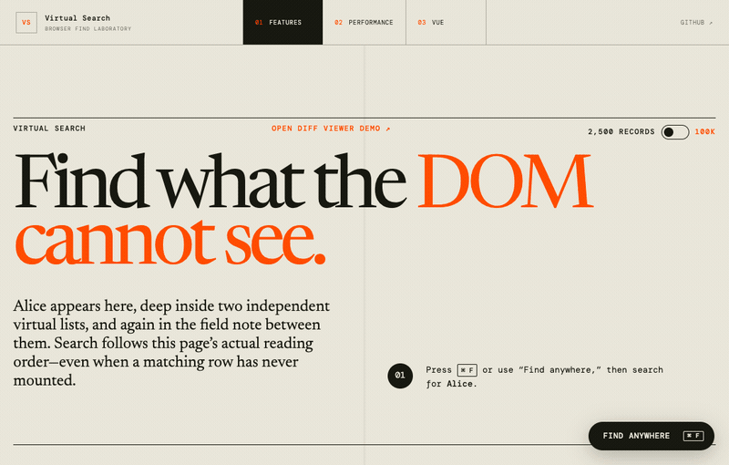

# Virtual Search

Virtual Search replaces a web page's Cmd/Ctrl+F experience with native-like
search across ordinary DOM content and records that have not been mounted by a
virtualizer. It preserves document-order navigation, scrolls matches into view,
and reports a complete `X of Y` count across multiple independent lists.

The browser's Find panel cannot be extended or queried by page JavaScript, so
Virtual Search uses an opt-in keyboard shortcut and an in-page search panel.

Try the [**Feature Demonstration**](https://kamikaz1k.github.io/virtual-search/),
the [**Performance Demonstration**](https://kamikaz1k.github.io/virtual-search/diff/),
or the [**Vue Integration Demonstration**](https://kamikaz1k.github.io/virtual-search/vue/).

[](https://kamikaz1k.github.io/virtual-search/)

It also handles several cases that are easy for a custom Find implementation to
miss:

- **Virtualized content:** search every record without mounting every row.
- **Input values:** index live text-like input and textarea values, with an
  optional exact-substring overlay highlight.
- **Shadow DOM:** accept ranges inside shadow roots without injecting styles
  into application-owned roots.
- **Mobile viewports:** keep the built-in panel reachable while iOS keyboards
  and browser chrome change the visual viewport.
- **Revealable content:** open closed `<details>` elements and support
  `hidden="until-found"` and application-owned reveal behavior.

## Quick Start

### Install

Install the framework-agnostic core without pulling in a framework:

```sh
npm install virtual-search
```

React, Vue, and TanStack Virtual are optional peer dependencies, so npm only
installs the framework-specific packages you explicitly choose:

```sh
# React (omit react and react-dom if your app already has them)
npm install virtual-search react react-dom

# Vue (omit vue if your app already has it)
npm install virtual-search vue

# TanStack React Virtual adapter
npm install virtual-search react react-dom @tanstack/react-virtual

# Vue + TanStack Virtual (uses the callback adapter)
npm install virtual-search vue @tanstack/vue-virtual
```

The React Window and React Virtuoso adapters use structural ref types and do
not add runtime dependencies. Install `react-window` or `react-virtuoso` only
when your application uses that virtualizer.

### React

Wrap the searchable portion of the page in one provider, install the Find
shortcut, and render the built-in panel:

```tsx
import { useRef } from "react";
import {
  SearchPanel,
  useFindShortcut,
  VirtualSearchProvider,
} from "virtual-search/react";

function SearchControls() {
  useFindShortcut();
  return <SearchPanel />;
}

export function App() {
  const rootRef = useRef<HTMLElement>(null);

  return (
    <VirtualSearchProvider rootRef={rootRef}>
      <SearchControls />
      <main ref={rootRef}>
        <p>Ordinary DOM is searchable automatically.</p>
        <CustomerList />
        <OrderList />
      </main>
    </VirtualSearchProvider>
  );
}
```

`SearchPanel` is optional. Use `useVirtualSearch()` to build a custom interface
around the headless state and the `open`, `close`, `setQuery`, `next`,
`previous`, and `goTo` commands.

Opening or refocusing Find does not move the page. Navigation happens when the
query changes or the user explicitly requests another result.

### Vue

Call `provideVirtualSearch()` in the component that owns the searchable root.
The returned object is shallow-reactive, so its state can be read directly in
scripts and templates:

```vue
<script setup lang="ts">
import { ref } from "vue";
import {
  provideVirtualSearch,
  SearchPanel,
  useFindShortcut,
} from "virtual-search/vue";

const root = ref<HTMLElement | null>(null);
const search = provideVirtualSearch({ root });
useFindShortcut({ search });
</script>

<template>
  <SearchPanel />
  <main ref="root">
    <p>Ordinary DOM is searchable automatically.</p>
    <CustomerList />
    <OrderList />
  </main>
</template>
```

Descendant components can call `useVirtualSearch()`, `useFindShortcut()`, and
`useVirtualSearchRegion()` without passing `search`. Provider and consumer
composables must run synchronously during `setup()`.

### Vue + TanStack Virtual

The provider makes ordinary DOM searchable, but a virtual list must also
register its complete data set with `useVirtualSearchRegion()`. This is what
allows records that are not currently mounted to appear in the result count.

The returned bindings connect the searchable corpus back to the elements that
the virtualizer eventually renders:

- `regionAttrs` goes on the virtualizer's scroll element.
- `itemAttrs(key)` goes on each mounted row.
- `partAttrs(key, partId)` goes on the element that renders each indexed part.

```vue
<script setup lang="ts">
import { useVirtualizer } from "@tanstack/vue-virtual";
import { computed, ref } from "vue";
import {
  callbackVirtualizerAdapter,
  useVirtualSearchRegion,
} from "virtual-search/vue";

const props = defineProps<{ customers: readonly Customer[] }>();
const scrollElement = ref<HTMLElement | null>(null);
const customers = computed(() => props.customers);

const virtualizer = useVirtualizer(computed(() => ({
  count: customers.value.length,
  getScrollElement: () => scrollElement.value,
  estimateSize: () => 56,
  overscan: 6,
})));

const virtualRows = computed(() => virtualizer.value.getVirtualItems());
const totalSize = computed(() => virtualizer.value.getTotalSize());

const search = useVirtualSearchRegion({
  id: "customers",
  anchorRef: scrollElement,
  items: customers,
  getKey: customer => customer.id,
  getSearchParts: customer => [
    { id: "name", text: customer.name },
    { id: "email", text: customer.email },
  ],
  virtualizer: callbackVirtualizerAdapter((index, options) => {
    virtualizer.value.scrollToIndex(index, { align: options.align });
  }),
});

function customerAt(index: number) {
  return customers.value[index];
}
</script>

<template>
  <div
    ref="scrollElement"
    v-bind="search.regionAttrs"
    style="height: 400px; overflow: auto"
  >
    <div :style="{ height: `${totalSize}px`, position: 'relative' }">
      <template v-for="virtualRow in virtualRows" :key="virtualRow.key">
        <div
          v-if="customerAt(virtualRow.index)"
          v-bind="search.itemAttrs(customerAt(virtualRow.index)!.id)"
          :style="{
            position: 'absolute',
            width: '100%',
            height: `${virtualRow.size}px`,
            transform: `translateY(${virtualRow.start}px)`,
          }"
        >
          <strong
            v-bind="search.partAttrs(
              customerAt(virtualRow.index)!.id,
              'name',
            )"
          >
            {{ customerAt(virtualRow.index)!.name }}
          </strong>
          <span
            v-bind="search.partAttrs(
              customerAt(virtualRow.index)!.id,
              'email',
            )"
          >
            {{ customerAt(virtualRow.index)!.email }}
          </span>
        </div>
      </template>
    </div>
  </div>
</template>
```

`getSearchParts()` is the authoritative text for every record, including
unmounted ones. When a result is selected, the adapter scrolls to its index;
Virtual Search then waits for the row identified by `itemAttrs()` to mount and
highlights the element identified by `partAttrs()`.

For a single text value, use `getText` instead of `getSearchParts`. Replace the
`items` ref or computed value when the data set changes so the corpus is
invalidated automatically.

### React + TanStack Virtual

Register each virtual list with `useVirtualSearchRegion()` so its unmounted
records can participate in the same ordered search surface:

```tsx
import { useRef } from "react";
import { useVirtualizer } from "@tanstack/react-virtual";
import { useVirtualSearchRegion } from "virtual-search/react";
import { tanstackVirtualAdapter } from "virtual-search/tanstack";

function CustomerList({ customers }: { customers: Customer[] }) {
  const scrollRef = useRef<HTMLDivElement>(null);
  const virtualizer = useVirtualizer({
    count: customers.length,
    getScrollElement: () => scrollRef.current,
    estimateSize: () => 56,
  });
  const search = useVirtualSearchRegion({
    id: "customers",
    anchorRef: scrollRef,
    items: customers,
    getKey: customer => customer.id,
    getSearchParts: customer => [
      { id: "name", text: customer.name },
      { id: "email", text: customer.email },
    ],
    virtualizer: tanstackVirtualAdapter(virtualizer),
  });

  return (
    <div ref={scrollRef} {...search.regionProps}>
      {virtualizer.getVirtualItems().map(virtualRow => {
        const customer = customers[virtualRow.index];
        return (
          <div
            key={customer.id}
            {...search.itemProps(customer.id)}
            ref={virtualizer.measureElement}
          >
            <strong {...search.partProps(customer.id, "name")}>
              {customer.name}
            </strong>
            <span {...search.partProps(customer.id, "email")}>
              {customer.email}
            </span>
          </div>
        );
      })}
    </div>
  );
}
```

For a simple row, use `getText` instead of `getSearchParts`. The rendered row's
text must correspond to that authoritative search string.

## Full List of Features

### Search semantics

- Literal, occurrence-based substring matching.
- Case-insensitive matching by default, with a `caseSensitive` option.
- NFC normalization with correct offsets back into rendered text.
- One document-order result sequence across ordinary DOM and any number of
  virtual regions.
- Complete counts that include unmounted virtual records.
- First-match selection for a changed query, with next/previous wraparound.
- Opening or refocusing an existing search never navigates or scrolls.
- Stable occurrence preservation when the corpus changes where possible.

### Searchable content

- Ordinary visible DOM text under a configured root.
- Unmounted records supplied by virtual regions.
- Live values from text, search, email, telephone, and URL inputs and textareas.
- Closed `<details>` descendants and `hidden="until-found"` content.
- Ranges returned by custom integrations, including ranges inside shadow roots.
- Passwords, non-text controls, inert content, and ordinarily hidden content are
  excluded.

### Navigation and reveal

- Virtual rows are mounted before their matching ranges are located.
- Navigation waits for rendering and measurement before highlighting and
  scrolling.
- The region `reveal()` hook can also activate tabs, accordions, or other
  application-owned collapsed UI.
- Missing or still-hidden ranges produce `VirtualSearchRevealError` instead of
  silently selecting an invisible result.
- Search and navigation operations are abortable so stale work cannot move the
  selection or viewport.

### Highlighting and user experience

- CSS Custom Highlight ranges avoid inserting `<mark>` elements into
  framework-owned DOM.
- Exact input-value painting is available through an opt-in inert overlay.
- Escape closes Find and restores the previously focused element.
- The reference panel reports counts through an ARIA live region and exposes
  active work with `aria-busy`.
- The built-in panel guards against mobile visual-viewport changes, respects
  safe-area insets, and does not disable pinch zoom.
- Custom panels can reuse the same viewport behavior.

### Integrations and execution

- Framework-neutral TypeScript controller and region interfaces.
- React provider and hooks, Vue composables, and reference search panels for
  both frameworks.
- Adapters for TanStack Virtual, React Window v1/v2, React Virtuoso, and
  callback-driven virtualizers.
- Main-thread execution by default and an optional persistent Web Worker
  executor for large corpora.
- Corpus synchronization only when searchable content or ordering changes.
- Diagnostics for shadow-root matches that appear to lack visible highlight
  styles, without modifying the host application.

## Known Gaps

See [Native Find-in-Page behavior and Virtual Search parity](NATIVE_FIND_BEHAVIOR.md)
for known gaps, browser and OS differences, and the proposed conformance matrix.

## How Highlighting Works

Virtual Search separates finding a match from painting it:

1. Matching produces stable occurrences with a region, record, text part, and
   character offsets.
2. Navigation asks the owning document or virtual region to reveal the active
   occurrence. An unmounted virtual row is rendered before painting continues.
3. The integration locates the rendered text and returns one or more DOM
   `Range` objects. Ranges may live in the document or inside a shadow root.
4. The core replaces two entries in the document's CSS Custom Highlight
   registry: `virtual-search-match` for passive mounted results and
   `virtual-search-active` for the current result.
5. The active range is scrolled into view. Query changes, navigation, and
   cancellation rebuild or clear the owned highlights so stale ranges are not
   left behind.

Only mounted results are painted. Unmounted virtual results still contribute to
the count and navigation order, then receive a highlight after their region
reveals them. The library does not wrap text in `<mark>` elements or otherwise
rewrite framework-owned content.

Customize ordinary and virtual text highlights with CSS:

```css
::highlight(virtual-search-match) {
  background: rgb(255 210 0 / 35%);
}

::highlight(virtual-search-active) {
  background: #ffcf00;
  color: #171717;
  text-decoration: underline;
}
```

These pseudo-elements support a limited set of text-oriented CSS properties;
layout properties do not apply. If the CSS Custom Highlight API is unavailable,
search, counting, reveal, and scrolling continue to work, but DOM text is not
painted.

Input and textarea values are the exception because their `.value` text cannot
be represented by a DOM `Range`. With `inputValueHighlighting` enabled, Virtual
Search draws a separate `aria-hidden`, pointer-transparent mirror above each
matched control. It tracks scrolling, resizing, the visual viewport, control
scroll offsets, and font loading. The public customization surface currently
exposes its stacking order through `zIndex`; input overlay colors are not yet a
public option. See [Highlight matches in input values](#highlight-matches-in-input-values).

Shadow-root ranges use the same two highlight names. Styles can be inherited
through the host or declared more precisely in the component's own stylesheet.
Virtual Search diagnoses apparently unstyled shadow ranges but never inserts a
stylesheet into an application-owned root.

The two highlight names live in the document-wide registry. Use one controller
or React provider for a page-level search surface containing all of its virtual
regions; simultaneously active independent controllers would replace each
other's painted ranges.

## Customization Recipes

### Build a custom search panel

```tsx
import { useRef } from "react";
import {
  useSearchPanelViewport,
  useVirtualSearch,
} from "virtual-search/react";

function CustomSearch() {
  const search = useVirtualSearch();
  const panelRef = useRef<HTMLFormElement>(null);

  useSearchPanelViewport(panelRef, {
    anchor: "top",
    enabled: search.isOpen,
    padding: 10,
  });

  if (!search.isOpen) return null;

  return (
    <form
      ref={panelRef}
      role="search"
      data-virtual-search-panel=""
      aria-busy={search.status === "searching"}
      onSubmit={event => {
        event.preventDefault();
        void search.next();
      }}
    >
      <input
        type="search"
        aria-label="Search all page content"
        value={search.query}
        onChange={event => void search.setQuery(event.target.value)}
      />
      <output aria-live="polite">
        {search.status === "searching"
          ? "Searching…"
          : search.matches.length === 0
            ? "No results"
            : `${search.activeIndex + 1} of ${search.matches.length}`}
      </output>
      <button type="button" onClick={() => void search.previous()}>
        Previous
      </button>
      <button type="button" onClick={() => void search.next()}>
        Next
      </button>
      <button type="button" onClick={search.close}>Close</button>
    </form>
  );
}
```

Keep `data-virtual-search-panel` on the panel and use an
`<input type="search">` so `useFindShortcut()` can focus it after Cmd/Ctrl+F.

The built-in `SearchPanel` enables viewport protection automatically and
defaults to `viewportAnchor="top"`. For custom panels,
`useSearchPanelViewport()` publishes the following CSS properties:

- `--virtual-search-viewport-top`
- `--virtual-search-viewport-left`
- `--virtual-search-viewport-width`
- `--virtual-search-viewport-height`

A permanent top anchor is the most reliable mobile choice because it does not
need to infer the keyboard-adjusted bottom edge while Mobile Safari animates.
Use `anchor: "preserve"` when the application owns the panel anchor, or omit the
hook when the application owns all viewport management.

### Highlight matches in input values

Text-like control values are indexed automatically. Exact substring painting
is explicitly opt-in because an input's `.value` cannot be targeted by a DOM
`Range`:

```tsx
<VirtualSearchProvider
  rootRef={rootRef}
  inputValueHighlighting={{ mode: "overlay", zIndex: 1000 }}
>
  {children}
</VirtualSearchProvider>
```

Omit `inputValueHighlighting` to disable only the overlay. Input values remain
indexed, counted, and navigable.

Overlay mode places an inert translucent mirror over the matched substring
without taking focus from Find. It mirrors padding, fonts, direction, wrapping,
and the control's internal scroll position. Transformed or unsupported control
geometry falls back to a whole-control marker.

The option is fixed for the controller's lifetime. Recreate the controller, or
remount the React provider with its own executor, to change it at runtime. The
records demo includes an **Input text highlight** switch for comparing both
modes.

### Use another virtualizer

Every integration ultimately uses the same `VirtualizerAdapter` contract. If a
dedicated adapter is not provided, wrap the virtualizer's scroll method:

```ts
import { callbackVirtualizerAdapter } from "virtual-search";

const adapter = callbackVirtualizerAdapter((index, { align }) => {
  return virtualizer.scrollToIndex(index, { align });
});
```

The callback may return immediately or return a promise. Pass `adapter` as the
`virtualizer` option to the React or Vue region registration. For
application-specific data changes, call
`useVirtualSearchController().invalidate(regionId)` explicitly.

#### React Window

```tsx
import { List, useListRef } from "react-window";
import { useVirtualSearchRegion } from "virtual-search/react";
import { reactWindowAdapter } from "virtual-search/react-window";

const listRef = useListRef();
const search = useVirtualSearchRegion({
  id: "customers",
  getAnchor: () => listRef.current?.element ?? null,
  items: customers,
  getKey: customer => customer.id,
  getText: customer => customer.name,
  virtualizer: reactWindowAdapter(listRef),
});

<List
  listRef={listRef}
  rowCount={customers.length}
  /* Spread search.regionProps on the List and search.itemProps(key) on rows. */
/>;
```

The adapter detects React Window v1 handles and calls
`scrollToItem(index, align)`. With v1, pass the list's `outerRef` as
`anchorRef`.

#### React Virtuoso

```tsx
import { Virtuoso, type VirtuosoHandle } from "react-virtuoso";
import { useVirtualSearchRegion } from "virtual-search/react";
import { reactVirtuosoAdapter } from "virtual-search/react-virtuoso";

const virtuosoRef = useRef<VirtuosoHandle>(null);
const scrollerRef = useRef<Element>(null);
const search = useVirtualSearchRegion({
  id: "orders",
  anchorRef: scrollerRef,
  items: orders,
  getKey: order => order.id,
  getText: order => order.reference,
  virtualizer: reactVirtuosoAdapter(virtuosoRef),
});

<Virtuoso
  ref={virtuosoRef}
  scrollerRef={element => {
    scrollerRef.current = element instanceof Element ? element : null;
  }}
  data={orders}
  {...search.regionProps}
  itemContent={(_, order) => (
    <div {...search.itemProps(order.id)}>{order.reference}</div>
  )}
/>;
```

#### Callback adapter

```tsx
import { callbackVirtualizerAdapter } from "virtual-search";

const virtualizer = callbackVirtualizerAdapter(
  (index, { align }) => myVirtualizer.reveal(index, align),
);
```

The raw `VirtualizerAdapter` interface is exported for application-specific
integrations.

### Offload matching to a Web Worker

Create an application-owned worker entry:

```ts
// search.worker.ts
import "virtual-search/worker/runtime";
```

Pass a persistent executor to the provider or core controller:

```tsx
import { createWorkerExecutor } from "virtual-search/worker";

const executor = createWorkerExecutor({
  worker: new Worker(new URL("./search.worker.ts", import.meta.url), {
    type: "module",
  }),
});

<VirtualSearchProvider rootRef={rootRef} executor={executor}>
  {/* ... */}
</VirtualSearchProvider>
```

The executor synchronizes the corpus when searchable text or ordering changes;
individual queries send only the query and options. `AbortSignal` cancellation
is translated into cooperative worker messages.

### Style highlights inside Shadow DOM

A custom region's `locate()` hook may return ranges inside a shadow root. The
core owns those ranges through the same `virtual-search-match` and
`virtual-search-active` highlights used for ordinary DOM. Do not create a
second integration-owned highlight in `reveal()`.

Virtual Search never inserts or removes styles from an application-owned
document or shadow root. When a returned shadow range appears to lack visible
styles, the library emits one console warning for that region and highlight
name. Disable this best-effort diagnostic when the application intentionally
uses invisible highlights or a styling mechanism the browser cannot inspect:

```tsx
<VirtualSearchProvider
  rootRef={rootRef}
  diagnostics={{ missingHighlightStyles: false }}
>
  {children}
</VirtualSearchProvider>
```

### Reveal application-owned content

Ordinary DOM matches automatically open closed `<details>` ancestors. For
`hidden="until-found"`, Virtual Search dispatches `beforematch`, removes the
attribute, and then highlights and scrolls to the text. The synthetic event
uses native ordering but has `isTrusted === false`.

Application-owned tabs, accordions, and collapsed panels should reveal
themselves through a virtual region's `reveal(occurrence, context)` hook. It
runs for every active virtual match, including already-mounted rows, and should
resolve only after the matching content is rendered. Keep it idempotent.

### Keep responsive search data truthful

Native Find searches the current presentation. Content removed with
`display: none`, `visibility: hidden`, the regular `hidden` attribute, or
`content-visibility: hidden` is normally not a result. Virtualized content is
different because it represents content that will be visible after its row is
mounted.

Keep each virtual region's authoritative search parts aligned with the current
responsive layout. If a breakpoint removes an email column, omit the email
part from `getSearchParts` at that breakpoint and call `invalidate(regionId)`
when it changes. That avoids invisible navigation steps and keeps `X of Y`
truthful.

# Research

- [RESEARCH.md](RESEARCH.md) surveys browser Find behavior and existing
  approaches.
- [NATIVE_FIND_BEHAVIOR.md](NATIVE_FIND_BEHAVIOR.md) tracks the native behavior
  target and current implementation parity.
- [VIEWPORT_RESEARCH.md](VIEWPORT_RESEARCH.md) records iOS keyboard and visual
  viewport findings, failed approaches, reproductions, and device validation.
- [docs/V1_CONTRACT.md](docs/V1_CONTRACT.md) defines the current API and behavior
  contract.

# Development

```sh
pnpm install
pnpm lint
pnpm test
pnpm typecheck
pnpm build
pnpm check
pnpm dev
```

The workspace uses the native TypeScript 7 compiler and type-aware Oxlint.
`pnpm check` runs linting, typechecking, every workspace test suite, and both
production builds; it is also the deployment quality gate.

### npm releases

The publishable package lives in `packages/virtual-search`. Its npm tarball is
restricted to compiled output, its package README, its license, and package
metadata. Preview the exact artifact without publishing:

```sh
cd packages/virtual-search
npm pack --dry-run
```

The package is available as [`virtual-search` on
npm](https://www.npmjs.com/package/virtual-search). To automate future
releases, configure `publish-npm.yml` as the package's GitHub trusted publisher
for repository `kamikaz1k/virtual-search`. Publishing a GitHub Release then
runs the complete quality gate and publishes through short-lived OIDC
credentials; no npm token is stored in GitHub.

The release tag and `packages/virtual-search/package.json` version must agree.
An npm package name and version cannot be reused after publication.

`pnpm dev` prints the local URL, normally `http://localhost:5173`. Do not open
`apps/demo/dist/index.html` directly: module workers and generated assets must
be served over HTTP. To inspect a production build, run `pnpm build` followed
by `pnpm preview`.

The main demo contains ordinary content and 2,500 records across two virtual
lists, plus a 100,000-record stress mode. Useful searches include:

- `Alice` for document-order navigation across DOM and virtual regions.
- `alice.chen.39999@example.test` for a record near the end of the stress data.
- `Orchid Protocol` for input-value highlighting and a closed `<details>`.
- `Cobalt Archive` for a textarea value and `hidden="until-found"` content.

The `/diff/` demo exercises search over a large virtualized patch viewer.

# Contributions

This project is not currently seeking external contributions. The repository is
public for evaluation and reference, but unsolicited pull requests are not
being accepted at this stage.
